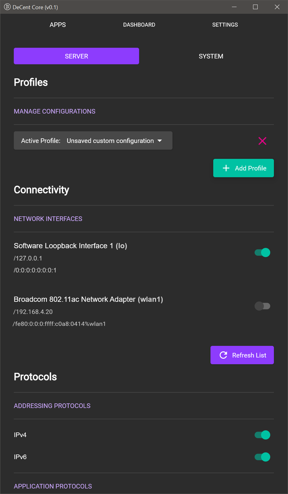
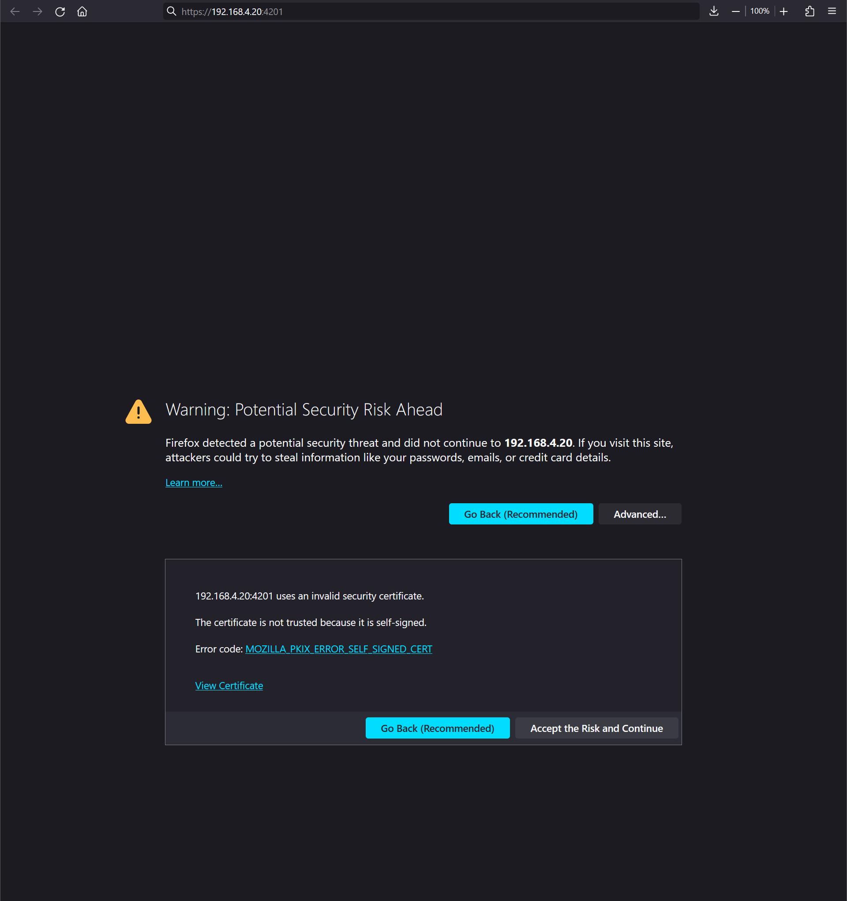

# Welcome, Good people!

<table>
  <tr>
    <td></td>
    <td></td>
  </tr>
</table>

## Contents

<ul>
    <li>
        <a href="#introduction">Introduction</a>
    </li>
    <li>
        <a href="#overview">Overview</a>
    </li>
    <li>
        <a href="#system-requirements">System Requirements</a>
    </li>
    <li>
        <a href="#contribute">Contribute</a>
    </li>
    <li>
        <a href="#downloads">Downloads</a>
    </li>
    <li>
        <a href="#planned-features">Planned Features</a>
    </li>
</ul>

## Introduction

>Fuck the Babylon, 
>who's trying to see what I'm on

This repository serves as a hub for the DeCent-Core project. 

DeCent-Core allows users to use DWAs to access Web420.

The application is written in Kotlin and uses Kotlin Multiplatform to target Windows, Linux, Android, and MacOS. The codebase will be open-sourced shortly, more below.

The current release state is: ***usable prototype***

Numerous known UI bugs exist, but there is enough stability for experimenting with DWAs.

## Overview 

DeCent-Core is an easy-to-use implementation of the DCNT server protocol. DeCent-Core provides two key functionalities:

- A simple interface for managing a self-hosted DCNT instance.
- A simple interface for installing and hosting decentralized web applications (DWAs) locally.

Self-hosting a DCNT server instance allows a user's web apps to receive proxied requests from within their networks, through a WebSocket connection to the locally-running DCNT server.

This allows specially designed web applications (DWAs) to use the available local connection to the DCNT server to receive connection requests and create WebRTC peer-to-peer connections directly to another web application. This enables an entirely new class of web applications to exist, DWAs.

In addition to facilitating connections between DWAs, DeCent-Core also offers the option of hosting installable (from ZIP archive) web apps and hosting them locally for the user. This allows users to select specific, trusted web applications, store the HTML/CSS/JS files locally, and then host the executing app code for the user in an SSL/TLS context. The SSL/TLS context allows the locally running web app to create WebRTC connections to other users, which will be signaled as described above. This removes the need for traditional hosting infrastructure for web applications.

By using DeCent-Core in conjunction with a trusted DWA, users are able to attain complete privacy through total control.

## System Requirements

In order to use DeCent-Core, you will need:

- A device running a compatible OS
- Network access (public or private)
- A modern web browser (Firefox is highly recommended)
- (***Optional***) VPN or tunneling service
- (***Optional***) (*Coming soon*) Domain name

DeCent-Core can operate over any network, public or private. If exposing DeCent-Core to a public network, like the Internet, it's highly recommended to wrap the connection in a VPN or a trustworthy localhost-forwarding service.

## Contribute
The DeCent-Core codebase will be open-sourced shortly. Currently the codebase is undergoing some cleanup and refactoring from the prototype before release. 

In the meantime, if you're interested in implementing your own DCNT-compatible server, the protocol documentation should be enough to get you started.

## Downloads
DeCent-Core executables

- Windows: <a href="https://filebin.net/6p9g2amgpf6v1apg/DeCent-Core.zip" target="_blank">https://filebin.net/6p9g2amgpf6v1apg/DeCent-Core.zip </a>
- Linux: Coming soon
- Android: Coming soon

## Planned Features

Some of the features planned for future releases:

- Mutual TLS authentication option for incoming connections
- Integrated STUN server for a completely private signaling stack
- HTTP Authentication support for restricting server access
- Allowlist/blocklist for remote connections
- Let's Encrypt integration for trusted certificate generation and management
- DNS management integration for easy domain addressing
- Optional configuration and database encryption
- Improved certificate keystore/truststore management
- UI bug fixes
- Improved documentation

## Documentation

  

    Installation Guide
  

## Installation

To install and run DeCent-Core follow these steps:

    1. Download the ZIP archive containing the application code and executables for your compatible OS.
    2. Extract the archive to a location that pleases you.

To stop the application, use the ***Quit*** option from the system tray.

  

    User Guide
  

## Launching DeCent-Core

To launch DeCent-Core, run the ***DeCent-Core*** executable

## Exiting DeCent-Core

To close the application, use the ***Quit*** option from the system tray.

## Configuring Your Device

When DeCent-Core launches, it will attempt to find files (configuration, database, keystores) necessary for operation. If the files are not found, then the Application Configuration dialog will be shown. This will happen the first time the app runs, or if the associated files are deleted and cannot be found.

  <table>
    <tr>
      <td></td>
      <td></td>
      <td></td>
      <td></td>
    </tr>
    <tr>
      <td></td>
      <td></td>
      <td></td>
      <td></td>
    </tr>
  </table>

1. Choose between automatic setup, or custom configuration for more granular control.
2. Select a location for the DeCent-Core database file (Currently non-functional, file will be created in DeCent-Core root directory).
3. Select a location for the DeCent-Core keystore file (Currently non-functional, file will be created in DeCent-Core root directory).
4. (***Optional***) Set a keystore password (Currently non-functional, password will be an empty string).
5. Select a location for the DeCent-Core app storage directory. (Currently non-functional, directory will be created in DeCent-Core root directory).
6. Configure user interface settings (Currently non-functional, default settings will be used during initial configuration creation).
7. DeCent-Core is being configured.
8. The Dashboard will be shown when the application is loaded and ready to be used.

## Settings Overview

The settings section contains an interface for configuring server profiles, as well as an interface for configuring system behavior. Navigate to the settings section by using the **SETTINGS** button at the top of the DeCent-Core UI.

Within the settings section, navigate between server settings and system settings using the **SERVER** and **SYSTEM** buttons, respectively.

  <table>
    <tr>
      <td></td>
      <td></td>
      <td></td>
      <td></td>
    </tr>
  </table>

<ol>
    <li>Navigate from the Dashboard to the Settings section using the <b>SETTINGS</b> button at the top of DeCent-Core.</li>
    <li>
        
In the server settings, use the available options to configure the DCNT server settings. When changes to the settings are made, the <b>Active Profile</b> will change to "<i>Unsaved custom configuration</i>". While it's fine to start and operate the server under an unsaved custom configuration, if the configuration isn't saved as a profile before exiting the app, the settings will not be persisted through application restarts.

        <h3>Server Settings</h3>
        <ul>
            <li>Profiles - Manage (add/remove) profiles and set the Active Profile</li>
            <li>Connectivity - Select which network interfaces will be used to listen for DCNT WebSocket connections. The <b>lo</b> (localhost/127.0.0.1) interface will always be selected.</li>
            <li>Protocols - Select which protocols the DCNT server will support</li>
            <li>Bindings - Select which ports the DCNT server will listen on.</li>
            <li>Security - Manage security settings and certificates.</li>
        </ul>
         
    </li>
    <li>Server settings cont.</li>
    <li>
        
In the system settings section, use the available options to configure how DeCent-Core behaves when running. The configuration will be stored in a configuration file (configuration.json) and is separate from server profiles. Currently, changes made to the System Settings will persist through application restarts without any required action.

        <h3>System Settings</h3>
        <ul>
            <li>Profiles - Manage (add/remove) profiles and set the Active Profile</li>
            <li>Connectivity - Select which network interfaces will be used to listen for DCNT WebSocket connections. The <b>lo</b> (localhost/127.0.0.1) interface will always be selected.</li>
            <li>Protocols - Select which protocols the DCNT serve will support</li>
            <li>Bindings - Select which ports the DCNT server will listen on.</li>
            <li>Security - Manage security settings and certificates.</li>
        </ul>
         
    </li>
</ol>

## Generate A New Certificate

While DeCent-Core will generate a default certificate for you, additional certificates can be added and selected for use with the embedded DCNT server. This may be useful for managing different identities in conjunction with profiles.

<table>
    <tr>
        <td></td>
        <td></td>
        <td></td>
        <td></td>
    </tr>
    <tr>
        <td></td>
        <td></td>
    </tr>
</table>

<ol>
<li>To open the certificate generation dialog, use the <b>Add Certificate</b> button.</li>
<li>In the dialog, the name, password, certificate algorithm, and certificate key size can be configured. Password is optional.</li>
<li>Input a name, use the default settings or change what you want. When the form is ready, use the <b>Next</b> button to generate the certificate.</li>
<li>Certificate is being generated.</li>
<li>Once generation is complete, the new certificate will be added to the list in server settings. For now, you need to manually select it after creation.</li>
<li>The generated certificate is selected to be used in the current server configuration/profile.</li>

</ol>

## Create A Server Profile

As mentioned above, setting the newly generated certificate as the active server certificate caused the **Active Profile** to change to "<i>Custom unsaved configuration</i>". If the application were closed right now, the current server configuration would be lost. Instead of needing to reconfigure the server everytime the application starts, you can use profiles to quickly hop back and forth between different server configurations. Note that the server must be restarted manually after profile changes or the configuration used to start the server will continue to be used. Once you have created and loaded a profile, you can freely make changes to the settings, and the profile record will be automatically updated. The only time a configuration could potentially be lost is when the <i>Default</i> profile is selected and changes are made to the configuration. This is the only time a custom unsaved configuration will be triggered.

<table>
    <tr>
        <td></td>
        <td></td>
        <td></td>
        <td></td>
    </tr>
    <tr>
        <td></td>
        <td></td>
    </tr>
</table>

1. The unsaved custom configuration can be seen on the Dashboard
2. From the Server Settings, use the **Add Profile** button to open the Add Profile dialog.
3. The Add Profile dialog is open.
4. Give your profile a name.
5. The profile has been created and set as the Active Profile
6. The Dashboard shows that the new profile has been selected and is ready to go.

## Add Network Interfaces To The Server Configuration

Out of the box, DeCent-Core defaults to only the <b>localhost/127.0.0.1 (lo)</b> network interface. Because the localhost network interface is a local loopback address, anything being served on this network interface will only be available on the device running the server. This means that it will be impossible for any other devices to connect to the DCNT server at this point.

In order for other users of your networks to be able to connect to your DCNT server, the server must be configured to listen on another network interface with network access. These networks can be private or public. In the example below, the "<i>wlan1</i>" network interface will be added to the server configuration. This will allow other devices on the local wireless network to make connections to the DCNT server. The same steps can be used to configure the DCNT server to listen on a network interface with a public address, for example, an interface to a VPN connection with a public IP or the ability to handle port forwarding. Using a network interface connected to a public address will allow other devices to connect to your DCNT server across the entire Internet. Protecting your open ports with a secure and trusted VPN or some other forwarding service (like Cloudflare Tunnel) is <b>highly recommended</b>.

<table>
    <tr>
        <td></td>
        <td></td>
        <td></td>
        <td></td>
    </tr>
</table>

1. From the Server Settings section, locate the network interface you would like to add to the current server configuration. In this case, the <b>wlan1</b> interface will be used. This will allow other devices on the same local network to connect to the DCNT server being configured.
2. The <b>wlan1</b> network interface has been selected.
3. On the Dashboard, the <b>Endpoints</b> list reflects the changes, the IPv4/IPv6 addresses for the <b>wlan1</b> network address are now displayed.
4. The server has been started with the updated configuration, the endpoints have now become clickable.
5. The newly added endpoint for the **wlan1** network interface is reachable by the browser. If the DCNT server is running a self-signed certificate like it is here, the certificate needs to be accepted by the browser of any device attempting to make a connection to the DCNT server.

## Starting The Server

To start, or stop the server from the user interface, navigate to the Dashboard. From the Dashboard, use the <b> green power</b> button to start the server. Once the server has started, the green power button will turn red.

## Stopping The Server

To stop the server, use the same power button that was used to start it. The button will be red while the server is running.

## Connecting To Endpoints

 ## Accepting Self-Signed Certificates

If the DeCent-Core server is using a self-signed certificate, anyone intending to connect with the server will need to manually accept the certificate in-browser before the connection will be allowed from the connecting browser. This includes your own connections. Generally, you should not use self-signed certificates to connect with users or devices you do not know or trust.

Using trusted certificates to identify your device is preferred (Support coming soon).

<table>
    <tr>
        <td></td>
        <td></td>
        <td></td>
        <td></td>
    </tr>
    <tr>
        <td></td>
    </tr>
</table>

1. The DCNT server is running, and the <b>endpoints</b> have been activated. Using the added WLAN1 network interface endpoint link for https://192.168.4.20:4201 (your address will be different) will open the address in the default browser.
2. The browser has attempted to connect to the endpoint at https://192.168.4.20:4201 (your address will be different) and found that the certificate the server is using is not trusted.
3. Using the "*Advanced*" button in the browser (Firefox) expands the page to include an option to accept the certificate. This page will look different in other browsers.
4. Using the "*Accept the Risk and Continue*" button (Firefox) will generate an exception for the self-signed certificate in the browser, allowing it to be used. Future connections to the endpoint will now succeed.
5. A blank page indicates that the endpoint has been loaded successfully.

## Authorizing Decentralized Web Applications (DWAs)

Once a DCNT server is configured and connectable, the next step is to find DWAs to use with your DCNT portal. This will allow you to connect to other users or devices through the DWA.

To authorize a DWA, there are two options:

1. By visiting a traditional hosted DWA in your browser, the DWA will attempt to connect to your local DCNT server and trigger an Authorization Request. If the request is granted, the hosted DWA will be able to communicate with your local DCNT server.
2. Load a DWA package from file in the Apps section of DeCent-Core (Instructions below).

<a href="">DeCent-Messenger</a> is an in-house messaging DWA, available as both a traditionally-hosted app on Github, and also as a locally-installable package. Read more about it on the project repository. To authorize a remotely-hosted DWA, simply visit the DWA in your browser. For example, if you have DeCent-Core running, and you visit the hosted version of DeCent-Messenger on Github and add a local server, an authorization request will appear in the DeCent-Core UI. If the request is denied, the application will be disconnected immediately. If the request is granted, the application will be allowed to communicate with the DCNT server.

## Installing Decentralized Web Applications (DWAs)

DWAs are also installable as self-contained ZIP packages composed of HTML/CSS/JS and required application files.

To install DeCent-Messenger in your DeCent-Core instance, use the <b>APPS</b> button at the top of the DeCent-Core UI to navigate to the Apps section. From the apps section, use the <b>Add App</b> dialog to install DeCent-Messenger.

The installation URL for the DeCent-Messenger package is: <a href="">https://someurl.com</a>

Once a DWA has been installed, it will be accessible in your browser when the DeCent-Core server is running. To easily launch the application, click on the app listing to open the App Management dialog and use the green URL to launch the DWA in your browser.

For more information on how to use DeCent-Messenger, visit the project repository and view the user guide.

<table>
    <tr>
        <td></td>
        <td></td>
        <td></td>
        <td></td>
    </tr>
    <tr>
        <td></td>
        <td></td>
        <td></td>
        <td></td>
    </tr>
</table>

1. Navigate to the Apps section by using the **APPS** button at the top of the DeCent-Core UI.
2. Paste in the URL of the DWA package you wish to install, in this case it is the DeCent-Messenger URL displayed above.
3. Wait while DeCent-Core fetches the application package, reads the manifest, and populates an authorization request within the DeCent-Core UI.
4. Because the authorization request is coming from a package instead of a hosted web app, there will be additional options on the Authorization Request dialog.
5. Once the application has been authorized, it will be installed, and a listing will appear in the Apps menu.
6. Clicking the listing will open the Manage App dialog, where the app can be launched or removed.
7. DeCent-Messenger has been launched from a self-hosted DeCent-Core server instance.
8. DeCent-Messenger can be used to communicate between devices with absolute privacy.

## Notes On Security

If you only intend to use DeCent-Core intermittently for short periods of time, say, to signal a peer connection and then shut down the DCNT server once the P2P connection has been established in your browser, you can probably use the system safely without a VPN or other protection if you must. The risk of opening ports increases exponentially as the length of time the port has been opened increases. Essentially, the more you expose your DCNT server to public networks, the more likely it is that it may eventually be identified and targeted in hacking attempts. If you rarely have your DCNT server online, and have only shared your address with trusted associates, there is reduced risk of running an unprotected connection. If you intend to run a DCNT server for longer periods of time, or perpetually, again, protecting your server is highly recommended.

One final and important note on the topic of running an unprotected DCNT instance, if you do this, you will generate firsthand metadata about the connection with ISPs.

Think of your DCNT address like a phone number, do not share your address with anyone that you don't trust, or don't know.

This application is currently a ***usable prototype***. It is likely to contain bugs that make it insecure at this point in time. While the tech is theoretically completely sound, and seemingly works in reality, the system needs further development and security audits before it can be considered truly secure.

 

